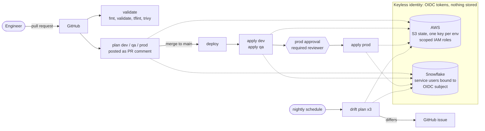

# Snowflake Platform as Code

Terraform and GitHub Actions that build and run a Snowflake platform across `dev`, `qa` and `prod`,
with **no stored credentials**, approval-gated production deploys, nightly drift detection and
cost guardrails. Built as a working demo of how I would run a data platform, not a toy: every
claim below was executed against a real Snowflake account and is visible in this repo's Actions
history and pull requests.

- **Snowflake:** Enterprise trial on AWS `us-east-1`. **AWS:** non-prod account for state and OIDC.
- **Terraform** 1.15, provider `snowflakedb/snowflake` pinned to `2.21.0`.

## What it does

| Capability | How | Where to look |
|---|---|---|
| Infrastructure as code for warehouses, roles, grants, cost limits, network policy | Terraform modules composed per environment | `modules/`, `stacks/platform` |
| Least-privilege RBAC | Access roles hold privileges, functional roles inherit them, users only get functional roles | `modules/rbac` |
| Keyless CI/CD | GitHub OIDC to AWS and to Snowflake (workload identity federation) | `.github/actions/tf-init`, `bootstrap/` |
| Promotion with approvals | PR plans for all envs, merge deploys `dev` then `qa`, `prod` waits for a human | `.github/workflows/deploy.yml` |
| Manual promotion | Deploy one commit to one environment (pin `qa`, hotfix `prod`), plan-only by default | `.github/workflows/promote.yml` |
| Drift detection | Nightly plan per env, opens or closes a GitHub issue, never auto-fixes | `.github/workflows/drift.yml` |
| Cost governance | Monthly resource monitors, small warehouses, statement timeouts | `stacks/governance`, `modules/warehouse` |
| Validation | `fmt`, `validate`, `tflint`, `trivy` as required checks | `.github/workflows/terraform-validate.yml` |
| AWS to Snowflake data access | S3 landing bucket, storage integration and external stage per environment, read-only, prefix-isolated | `modules/s3_integration`, `bootstrap/aws/landing.tf` |

## Architecture



## Design decisions and the tradeoffs I accepted

**Authentication: no secrets anywhere.** GitHub issues a short-lived OIDC token per job. AWS
accepts it through an IAM role whose trust policy pins the exact subject. Snowflake accepts it
through `WORKLOAD_IDENTITY` on a service user. There is no key, password or PAT in GitHub.
Account identifiers live in GitHub *secrets*, not variables, because this repo is public and
public Actions logs print variables but mask secrets.

**One Snowflake identity per GitHub context.** The OIDC `sub` claim differs for `pull_request`,
`main`, and each environment, so a job in `dev` cannot authenticate as the `prod` user.

| Snowflake user | OIDC subject (suffix) | Used for |
|---|---|---|
| `SVC_TF_PLAN_PR` | `pull_request` | PR plans |
| `SVC_TF_PLAN_MAIN` | `ref:refs/heads/main` | post-merge plans, drift |
| `SVC_TF_DEV` / `QA` / `PROD` | `environment:<env>` | applies, gated by the GitHub environment |

Plans run **without** a GitHub environment on purpose. Environment protection rules gate every
job that references the environment, so planning `prod` in a PR would otherwise stall on the
approval. Apply is the only thing that needs a human.

**GitHub's immutable subject claim.** New repos issue subjects like
`repo:<owner>@<owner-id>/<repo>@<repo-id>:...`, which survive renames and cannot be inherited by
a recreated repo of the same name. My first trust policies used the old name-only form and AWS
rejected the token. Check yours with `gh api repos/<repo>/actions/oidc/customization/sub`.

**One trunk, not a branch per environment.** The same commit is deployed to every environment and only
`envs/<env>/terraform.tfvars` differs, so what was tested in `dev` is byte-for-byte what reaches `prod`.
Branch-per-environment drifts (hotfixes that never merge back) and turns promotion into a code merge.
The automatic path always walks `dev` then `qa` then `prod`. For what it cannot express, `promote.yml`
deploys a chosen commit to a chosen environment. It only accepts commits reachable from `main`, runs
from `main` (the OIDC identities are bound to it), and is **plan-only unless `apply` is ticked**,
because `dev` and `qa` have no approval gate. Applying to `prod` still stops at the reviewer.

```
gh workflow run promote.yml -f environment=qa -f ref=<sha-or-tag>                 # plan only
gh workflow run promote.yml -f environment=prod -f ref=<sha> -f apply=true         # plan, approval, apply
```

**Plan artifact is what gets applied.** The plan job saves the plan file, the apply job downloads
it and applies exactly that. A reviewer approving `prod` approves the plan they can read. If state
changes in between, Terraform refuses the stale plan.

**Resource monitors are deliberately outside the pipeline.** Snowflake only lets `ACCOUNTADMIN`
create a resource monitor or attach one to a warehouse, and attaching needs `MODIFY` on the whole
*account*. I chose not to hand the pipeline account-wide `MODIFY`. So `stacks/governance` is
applied by a human, the pipeline creates warehouses with `ignore_changes` on the monitor, and
CI never sees `ACCOUNTADMIN`. The cost is that budget changes are slower than everything else,
which for a spend control is the right direction.

**Environments are prefixes in one account.** Objects are named `DEV_*`, `QA_*`, `PROD_*`, each
env has its own state file and its own directory (directories, not workspaces, so the diff between
environments is readable). A real platform would use one Snowflake account per environment. I
could not on a trial, and I would not hide that.

**The main module.** `stacks/platform` composes the leaf modules. `envs/<env>` are thin roots that
hold only a backend and that environment's `terraform.tfvars`, so promotion is a config diff, not
a code copy.

**S3 access without giving the pipeline IAM.** Each environment gets a Snowflake storage integration
and an external stage (`<ENV>_RAW.LANDING.S3_LANDING`) reading only `s3://<landing bucket>/<env>/`.
The bucket and the read-only IAM roles live in `bootstrap/aws`, so the pipeline that deploys Snowflake
never holds `iam:*`. Snowflake only reveals its IAM user and external ID after the integration exists,
so the trust is a two-phase handshake: the roles start trusting the AWS account, the pipeline creates
the integrations, then the trust is tightened to Snowflake's IAM user plus that integration's external
ID. Isolation is enforced twice: by the integration's allowed locations and by the IAM policy. I
tested it: reading `dev/` works, and pointing the `dev` integration at `prod/` is refused. The
account ID and role ARN are `sensitive` Terraform values so they do not appear in public plans.

## Security posture

- No long-lived credentials in GitHub, AWS or Snowflake CI paths.
- `TF_DEPLOYER` role has nine explicit account grants. It is not `ACCOUNTADMIN`.
- Network policy exists but is attached only to human demo users. GitHub-hosted runner IPs are not
  stable, so allow-listing them on the CI users would be fragile. A self-hosted runner with fixed
  egress is the production answer.
- State bucket: versioned, encrypted, public access blocked, S3-native locking (no DynamoDB).
  Apply roles can write only their own environment's state key.
- Branch protection on `main`: PR required, four checks required, no force-push.

## Known limitations (deliberate, and what I would do next)

1. **Plan users share `TF_DEPLOYER`.** A plan must refresh state, so it needs to read what the
   deployer owns. Next: a read-only `TF_PLANNER` role, so a malicious PR workflow cannot mutate
   Snowflake. Until then, workflow files should be protected with `CODEOWNERS`.
2. **State bucket uses SSE-S3, not a customer-managed KMS key.** Trivy flags this (AWS-0132). It is
   suppressed with a comment in `bootstrap/aws/main.tf`. Production would use a CMK.
3. **TFLint has no Snowflake ruleset.** It catches generic Terraform issues only. `validate`,
   `trivy` and the plan are the real safety net.
4. **Actions are pinned to major versions, not commit SHAs.** Production would pin SHAs.
5. **Admin bypass is on for branch protection.** Right for a one-person repo, wrong for a team.
6. **Drift on `snowflake_execute` resources (monitor attachment) is not detected.** The nightly
   plan covers everything else.
7. **Single account.** See above.
8. **The S3 trust handoff is manual.** After a new environment's integration exists, its IAM user and
   external ID are fed to `bootstrap/aws` (`snowflake_storage_iam`). It is a one-time step per
   environment. The landing roles are read-only, so unloading data to S3 is not covered.

## Repository layout

```
bootstrap/          one-time setup, run by a human
  snowflake_bootstrap.sql   TF_DEPLOYER role, OIDC service users (ACCOUNTADMIN, run once)
  aws/                      OIDC provider, state bucket, S3 landing bucket, scoped IAM roles (local state)
modules/            leaf modules: database, warehouse, rbac, network_policy, resource_monitor, s3_integration
stacks/platform/    the main module, composed per environment
stacks/governance/  ACCOUNTADMIN-only controls, applied manually
envs/{dev,qa,prod}/ thin roots: backend + terraform.tfvars
envs/governance/    root for the governance stack
.github/workflows/  reusable validate / plan / apply, plus pr, deploy, promote, drift callers
```

## Reproduce it

1. **Snowflake:** run `bootstrap/snowflake_bootstrap.sql` once as `ACCOUNTADMIN`. Adjust the OIDC
   subjects to your repo (`gh api repos/<repo>/actions/oidc/customization/sub`).
2. **AWS:** `cd bootstrap/aws && AWS_PROFILE=<non-prod> TF_VAR_expected_account_id=<id> terraform apply`.
   The `allowed_account_ids` guard aborts if the credentials belong to another account.
3. **GitHub:** create environments `dev`, `qa`, `prod` (required reviewer on `prod`, deploy only from
   `main`). Set repo secrets `SNOWFLAKE_ORGANIZATION_NAME`, `SNOWFLAKE_ACCOUNT_NAME`,
   `TF_STATE_BUCKET`, `AWS_PLAN_ROLE_ARN`, `AWS_ACCOUNT_ID`, and per-environment secret `AWS_APPLY_ROLE_ARN`.
4. **S3 trust (once per environment, after its first deploy):** read each environment's
   `terraform output -json s3_trust` and pass the three values to `bootstrap/aws` as
   `snowflake_storage_iam`, then re-apply it. Never commit them.
5. **Governance (once, as `ACCOUNTADMIN`):** apply `envs/governance`, then re-apply after each
   new environment so its warehouses get their monitor.
6. **Deploy:** push to `main`. Everything after that is the pipeline.

See [`docs/demo-script.md`](docs/demo-script.md) for a five-minute walkthrough.

## How this maps to running a data platform

| Responsibility | Demonstrated by |
|---|---|
| Warehouses, roles, permissions, resource monitors, networking | `modules/*`, `stacks/*` |
| Terraform as the source of truth | every object above; nothing is clicked into existence |
| CI/CD with validation, approvals, deployment, drift | `.github/workflows/` |
| Security posture | keyless auth, least-privilege roles, scoped state access, documented gaps |
| Cost governance | monitors, X-Small warehouses, 60s auto-suspend, statement timeouts |
| Operating it | drift issues, saved-plan applies, break-glass governance stack |
| Cross-platform (AWS + Snowflake) | S3 state, OIDC roles and a storage integration on AWS, WIF on the Snowflake side |
